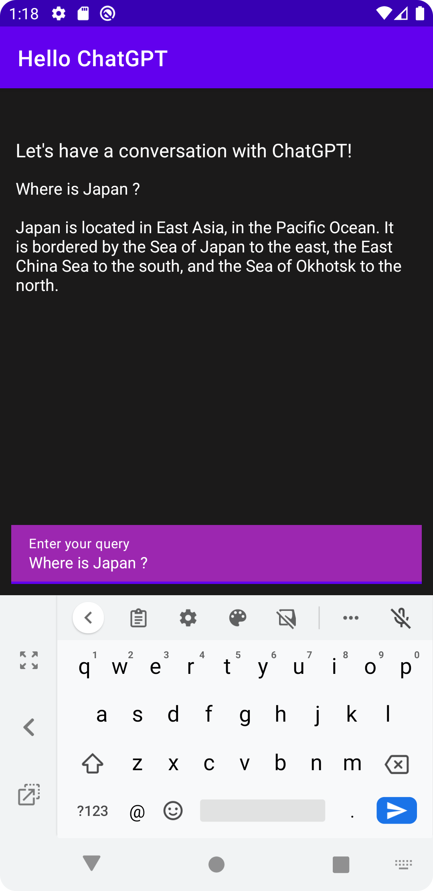

# hello-chatgpt

始めての ChatGPT Android アプリ。

参考サイト: [Building ChatGPT Android App using Retrofit and Dagger Hilt: Step-by-Step.](https://rehthink.medium.com/building-chatgpt-android-app-using-retrofit-and-dagger-hilt-step-by-step-dbf4b48bd4ca)

## 構成

* MVVM アーキテクチャパターンを採用  
  ViewModel + LiveData + ビューバインディング

* [Android 推奨のアーキテクチャ](https://developer.android.com/jetpack/guide?hl=ja) に準拠  
  UI Layer -> Domain Layer -> Data Layer

* [クリーンアーキテクチャ](https://www.amazon.co.jp/exec/obidos/ASIN/4048930656/maple036-22/) に準拠  
  Use Case / Controllers & Gateways & Presenters / External Interface .etc

## Dependencies

* 通信ライブラリ  
  [Retrofit](https://square.github.io/retrofit/)、 [OkHttp](https://square.github.io/okhttp/)

* DI(依存性の注入)ライブラリ  
  [Hilt](https://dagger.dev/hilt/)

* UI レイアライブラリ  
  [Android View Binding](https://developer.android.com/topic/libraries/view-binding?hl=ja)  
  
* JSON <=> String 変換ライブラリ  
  [Gson](https://github.com/google/gson) 


## API

* Open AI 
  [Completions](https://platform.openai.com/docs/api-reference/completions)


## 事前準備

[Open AI](https://openai.com/api/) アカウントを取得した上で、[seacret API Key](https://platform.openai.com/account/api-keys) を取得しておくこと。

取得した API Key は net/Constants.kt に設定する。

```
val API_KEY = "Your API Key"
```

## 画面のスクリーンショット

